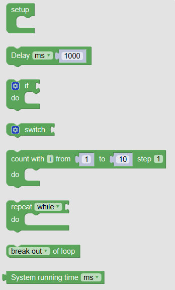
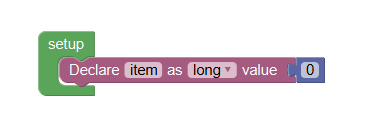
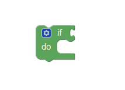
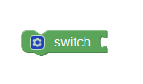
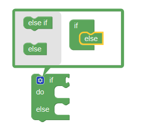
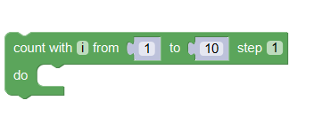
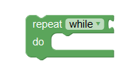
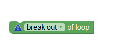
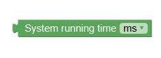

In this part, Mixly provides blocks that you can use to control the executive structure.

### Setup
The contents in Setup block are only executed once. Therefore, we often put the variable declaration or function definitions in the Setup block.

### DELAY

You can use the delay block to delay some time. The unit is millisecond (ms).

### IF and SWITCH
In Mixly, there are two conditional statements. One is IF-ELSE, another is SWITCH.
IF-ELSE: First, we will judge whether satisfy the condition in IF sentence. If TRUE, do a series of instructions. If FALSE, do another series of instructions. 

Click the blue button to add the ELSE sentence.

### LOOP
Mixly provides three kinds of loop structure: FOR, WHILE, and DO WHILE. This is the same as the C programming language.
The function of loop structure is to execute some code repeatedly. 

FOR: Using a count variable i from a to b. When the loop finishes once, i=i+step. When i>b, break the loop.

WHILE: If the condition is satisfied, do repeatedly until the condition returns false, then break the loop.

DO-WHILE: First, do the sentence, and then judge whether the condition is satisfied. If TRUE, do repeatedly, otherwise, break.

### SYSTEM RUNNING TIME
You can use this block to read the system running time from the program running.

