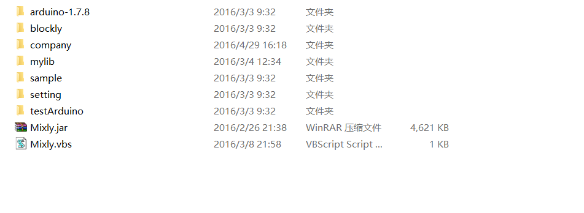
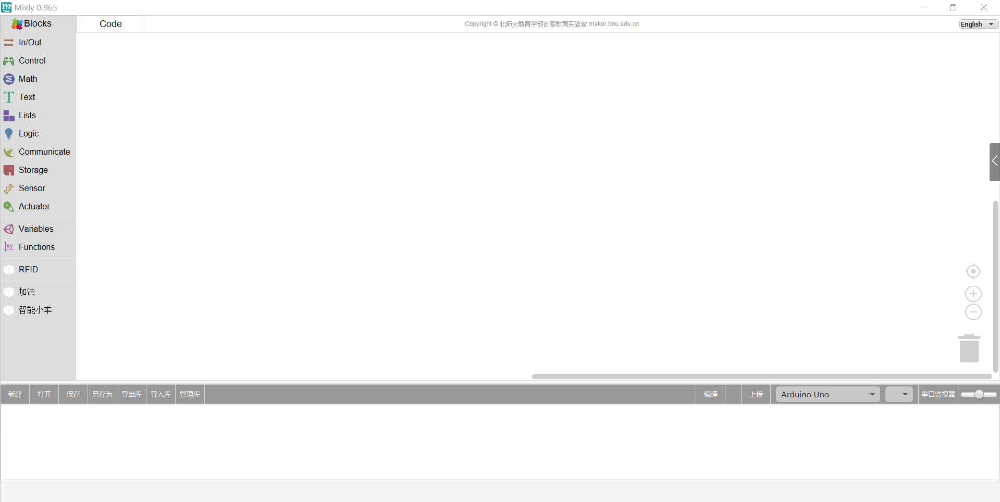

# How to install Mixly?
### Decompression
After you download the installation zip, please decompress it on your computer.

### Physical connection
Connect Arduino UNO with your computer or laptop using USB.
### install driver
The driver is in arduino-1.7.8\drivers
The complete process as the pictures below:
First,open your device manager, find "other devices"
Then,right click to update drivers.
After you finish installation, you will find a new serial port.

### Start Mixly
Double click Mixly.vbs under in the Mixly folder and you can enter the main interface of Mixly.
