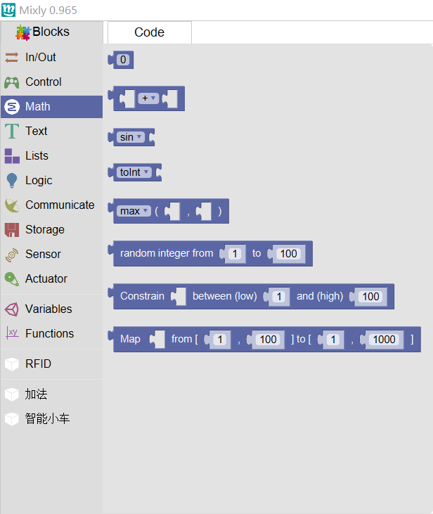

In this part, there are blocks that can be used in fundamental maths operation, including mapping, constraining, to INT, abs,sqrt, log etc.

### random

Using random block, you can get numbers randomly. The number is equal or greater than smallest number in the section, and must be smaller than biggest number.
### Constraining

Block Constraining can limit the value of number between maximum and minimum. 
### Mapping

Mapping can map variable i from set A to set B.