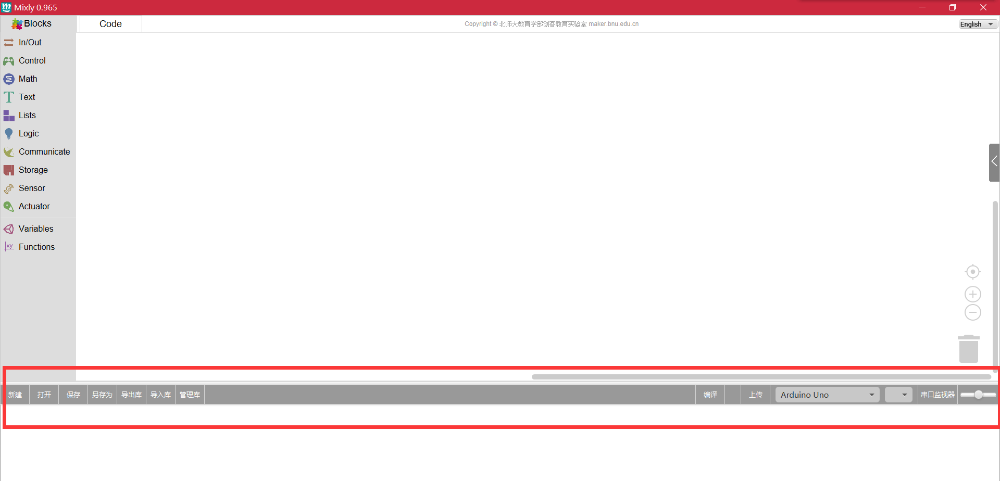

### General functions
In this part, there are some fundamental functions such as: new file, open file, save file, save as file. The format of the code Save or Save As is .xml. When users need to open the saved file, you must open it by Mixly software. In other words, when you want to open a code, you must first open Mixly software click the "Open" button, find the location of the code open. If you click directly .xml file of the code, you can only open the file with the source code.

### Library 
For the convenient of using, Mixly provides library function including import or export library and also can manage it.

### Compile&upload
After students have written the code, if you want to check the code logic is wrong or not, you can click on the compilation. If "Compilation failed", you need to follow the prompts to check your code, such as displaying "successful compilation" is logically prove that the code is correct, you can upload. 
If the "Upload Failed", plug the USB cable in most cases you can solve the problem; if "successful upload", then prove that the code has been uploaded to the board. Of course, if the student code logic for confidence can directly click the Upload button.
### Control board&port
There are many different kinds of main board that you can choose.

### Serial monitor

Serial communication module for use with the monitor module selection area in the serial communication command. Suppose students have connected the infrared receiver, he can always observing hexadecimal number of different buttons on the remote control through the serial port monitor (which received only a few real value FD beginning, other data are interfering with the data).
It should be noted that, after using the serial monitor, it need for timely closed. If the code re-upload without turning off the serial monitor the situation, often fail. Since taking up the serial monitor work-related port MPU, so it failed to upload.
### zooming
