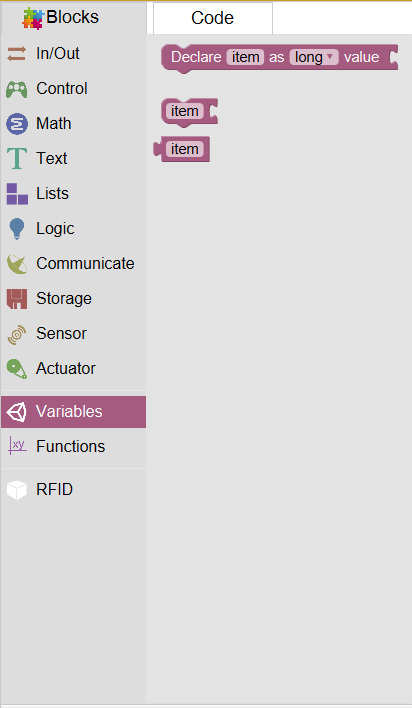

According to different types, variables can be divided into: Float, integer, bool and string. They all have values such as high or low, true or false.
When you are using variables(eg. in For loop you create i), in variable part, Mixly will automatically create a corresponding variable. You can use it directly.
