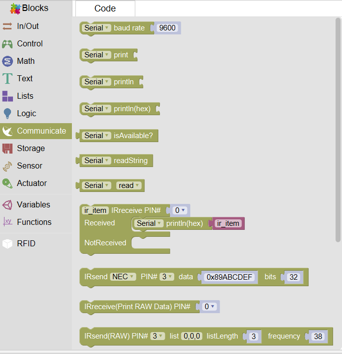
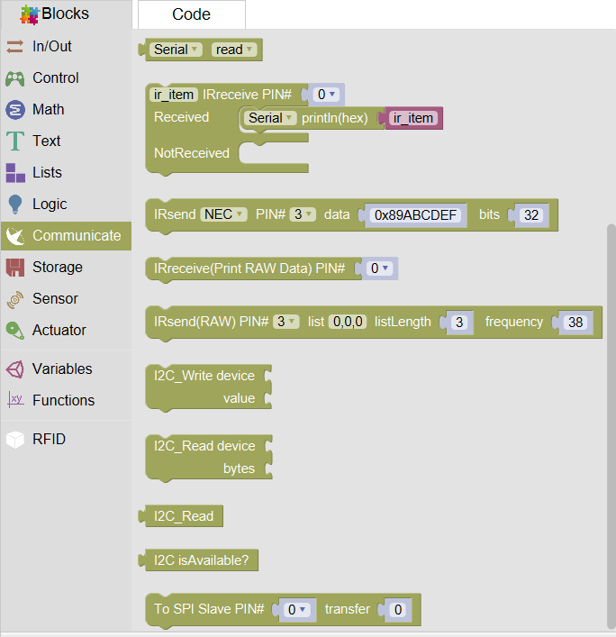
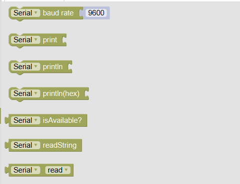
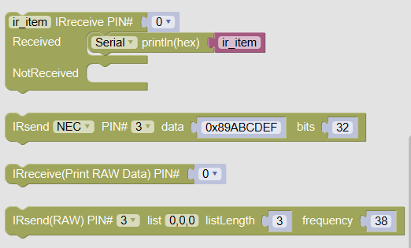
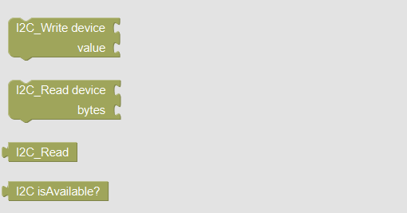

# Communication
Communication blocks provide a special communication way for human with computer. Including: setting baud rate, serial print, read string, irreceive, I2C communication, SPI communication(new).

### Serial communication

Serial communication let students have a look to variables in the serial monitor. It provides a convenient way to check the value of variables.
Serial print can print values or strings.
The difference between print and println is that Serial println can  take a new line automaticlly.
### Infrared communication
Infrared blocks provide sending and receiving functions for you so that you can using them to realize communication between infrared receivers and remote monitors.

### I2C communication
Inter-integrated Circuit, also called I2C, is a special way to realize Synchronous communication。There are many advantages. The control method is simple, the number of interface line is less, and it have a high communication rate.
Mixly supports I2C reading and writing, and support actuators based on I2C.

### SPI communication
Serial Peripheral Interface， also called SPI, is a high-speed, synchronous communication bus. It just uses four pins. It's simple, and easy to send data to SPI.
