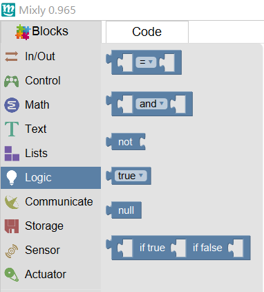

Most of the instructions in this part are used to do logic operation, including equation, AND, OR, NOT, TRUE or FALSE, and ? operation.
We just introduce ? operation.
A?B:C means if A is true, then execute B sentence, otherwise execute C sentence.