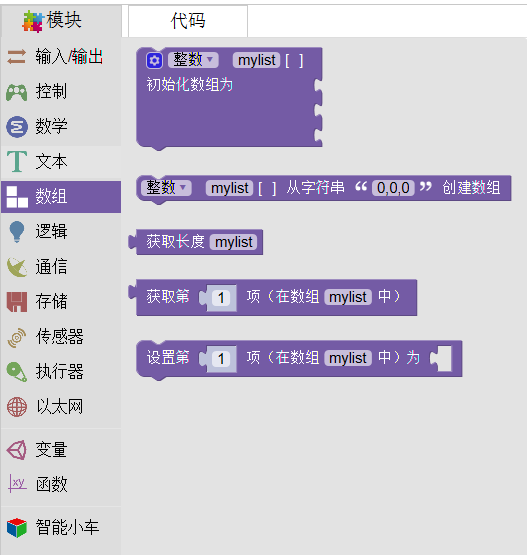
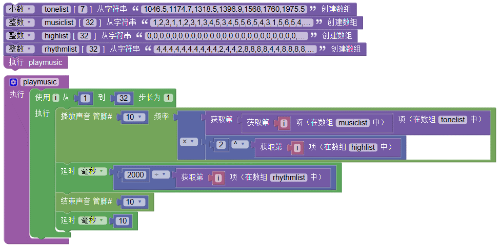

# Mixly 数组
数组是为了便于代码编写时所采用的一种数字块。具体包括：定义数组、取数组值、改数组值。

数组像一个大盒子，可以储存一定个数的数字（第一个指令）或字符串（第二个指令）。在课程中的音乐盒一课，我们就用到了数组。

如上图，tonelist, musiclist, highlist, rhythmlist分别储存了歌曲《两只老虎》的基本频率（即哆来咪等七音的对应频率），频率变化（即两只老虎的简谱数字），每个音的音名CDEFGAB以及每个音的时值（长短）。
《两只老虎》共有三十二个音，因此使用了一个从1到32的循环语句以此读取第一个音的频率变化（简谱，并通过语句可读取简谱的基本频率），随后与获取highlist里的对应音高并按thythmlist里的时值进行相应延时。
该代码将《两只老虎》的指令放到了一个名为playmusic的函数内，并通过执行 playmusic调用该函数。关于函数的内容，我们将在下面函数部分具体详解。
