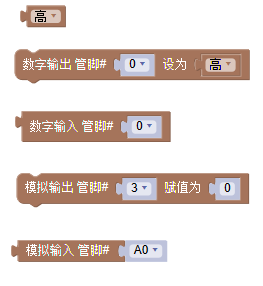
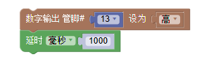
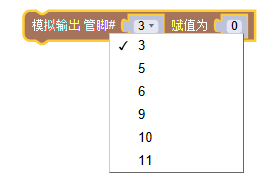
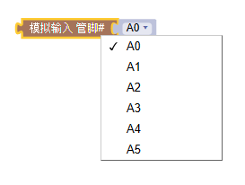
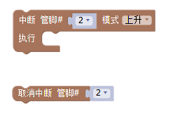
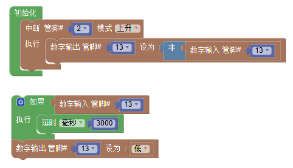
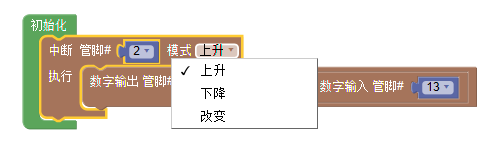
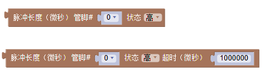
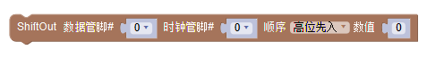

Mixly 输入&输出
================

输入输出所包含的指令主要分为四部分：控制管脚的输入输出（按信号类型可分为数字信号和模拟信号）、中断、脉冲长度及ShiftOut。

输入输出：数字输入、数字输出、模拟输入、模拟输出、中断控制、脉冲长度、移位输出

.. image:: images/02/inout1.png

数字输出
--------------

数字输入
--------------

模拟输出
--------------

依据信号是数字信号还是模拟信号以及信号的状态是输入还是输出进行适当的物理连接及代码选择。
例如如果想要点亮一盏LED灯（假设该灯连接管脚13），使用数字输出语句将管脚13的电平调为高即可。

如果想要使用模拟信号，就需要用到模拟管脚，当学生用模拟输出或模拟输入指令时，单击其下拉箭头，可看到Arduino所支持的模拟输出或模拟输入所支持的管脚口，省去学生记忆的时间。

输入/输出——中断指令
----------------

由于程序往往是顺序执行，但有时可能要突然打断正在执行的指令而转而去执行更加重要的指令，因此，中断的使用就显得尤为重要了。
以下是一个最典型的中断指令应用的案例，即按一下开关按键LED点亮三秒，三秒后自动熄灭，但如果在灯亮三秒内监测到开关按键再次按下，则LED立即熄灭。

Mixly的中断模式有三种可以选择：上升、下降及改变。
上升指的是按键的电平由低到高（实际上就是按键按下的过程）；
下降指的是按键的电平由高到低（实际上就是按键抬起的过程）；
改变指的是按键的电平由低到高或由高到低的过程（实际上就是按键按下或抬起的过程）。
当学生使用中断上升模式时，只要按下按键则立即执行中断语句内的指令，当执行完中断内指令后，代码将继续执行之前被打断的相应指令。

输入/输出——脉冲长度
-------------------

输入/输出——ShiftOut
-----------------

