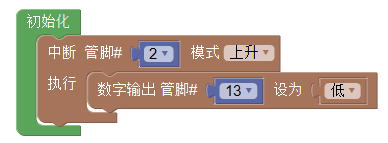
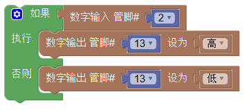
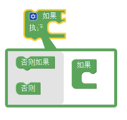
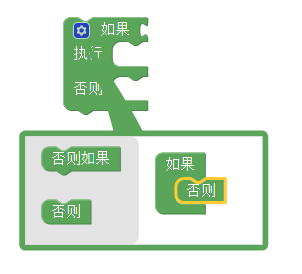
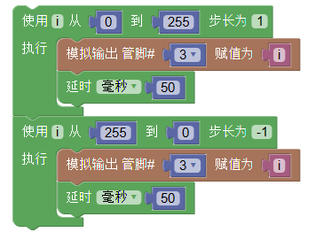

# Mixly 控制
时间延迟、条件执行、循环执行、获取时间、初始化、Switch执行（新增）
控制模块中主要执行的内容是对程序结构进行的相应控制。
## 初始化
初始化中的内容程序只执行一次，因此我们通常把一些变量的声明或函数定义（如中断）等放在初始化里。

## 条件语句
Mixly的条件语句为两个，一个是，另一个是

以为例：

可以理解为：当按键按下（按键接管脚2）时（此时【数字输入管脚#2】状态为1，满足条件句执行条件），LED（接管脚13）点亮；否则（即按键抬起后，【数字输入 管脚#2】状态为0，不满足执行条件，自动执行否则里面的内容）LED灭。在使用条件语句过程中需注意，该条件句左上角有一个小齿轮，当点击小齿轮时可得到如图

把否则拉入条件句内，如图所示

当对条件句操作完后，需再次点击左上角的小齿轮将弹出的窗口关闭。

## 循环语句
控制循环语句的代码有三条。
分别是：

循环语句的功能就是使某段代码重复运行。比如最常见的呼吸灯（手机提醒灯或者路由器的灯）。呼吸灯的效果是LED由慢慢由灭变量，后又慢慢由亮变灭的一种渐变灯。对于存在中间状态的渐变，用数字输出就无法实现了。

上图就是呼吸灯的代码。Arduino本身支持的模拟输出状态为256种，也就是0——255个数值。步长为每次循环变量增加的幅度。“使用i从0到255 步长为1“可以理解为i将以每次加1的增福由0变化到255。而我们在3号管脚接的LED的值也将是0，1,2,3……最后直到255。第二个循环块原理类似。

## 系统运行时间

该指令可以读取从代码编程开始到此时的系统时间。

### 程序范例

按下按键显示当前系统运行时间

